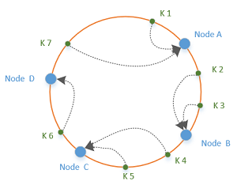
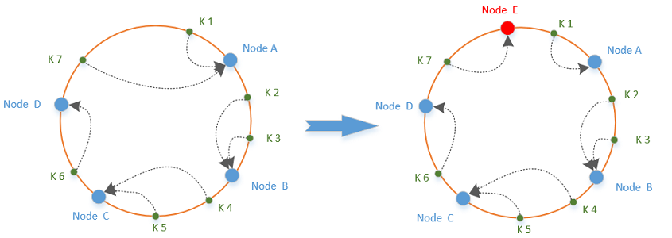
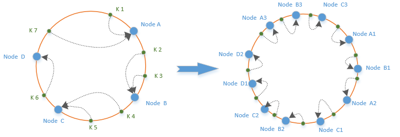

title: 一致性哈希算法
date: 2017-09-17 16:37
tags: 一致性哈希算法
category: [Java,算法]
---

# 一致性哈希算法（Consistent Hashing）
一致性哈希算法是分布式系统中常用的算法。比如在分布式缓存系统中，要将数据缓存到各个节点中，如果采用普通的hash算法，节点索引index = key.hashCode() % n，n为节点数量，当需要增加或者删除节点时，服务器上原有的缓存数据将全部失效。

一致性哈希算法将节点映射到一个封闭的哈希环上，采用哈希算法将需要查找或存储的数据映射到哈希环上，然后通过顺时针方向找到最近的节点。如图，蓝色为服务器节点，绿色为需要查找或存储的数据

当需要增加或者减少服务器节点的时候，其他节点在环上的位置不变，只有少部分的缓存数据发生了变化（NodeD与NodeE之间的数据，之前映射到NodeA，之后映射到NodeE），如图

但是这种结构存在数据分布不均匀的问题，会造成服务器负载不均衡。因此引入“虚拟节点”,每个真实节点复制成多个映射到哈希环上，当有足够多的节点的时候，就能保证服务器压力均衡。


# Java实现
```
package cc.laop.algorithm.hash;

import java.nio.ByteBuffer;
import java.nio.ByteOrder;
import java.util.List;
import java.util.SortedMap;
import java.util.TreeMap;

/**
 * Created by Child on 2017/9/17.
 */
public class ConsistentHashing<T> {

    private TreeMap<Long, T> nodeMap;

    private int virtual_node_num = 100;

    /**
     * 初始化节点
     *
     * @param nodelist
     */
    public void init(List<T> nodelist) {
        nodeMap = new TreeMap<Long, T>();
        for (T node : nodelist) {
            for (int j = 0; j < virtual_node_num; j++) {
                long hashcode = hash("Node-" + nodeMap.size() + "-" + j);
                nodeMap.put(hashcode, node);
            }
        }
    }

    /**
     * 添加节点
     *
     * @param node
     */
    public void addNode(T node) {
        if (nodeMap == null) {
            nodeMap = new TreeMap<Long, T>();
        }
        for (int j = 0; j < virtual_node_num; j++) {
            long hashcode = hash("Node-" + nodeMap.size() + "-" + j);
            nodeMap.put(hashcode, node);
        }
    }


    /**
     * @param key
     * @return
     */
    public T geNode(long key) {
        SortedMap tailmap = nodeMap.tailMap(key);
        if (tailmap == null || tailmap.size() == 0) {
            return nodeMap.get(nodeMap.firstKey());
        }
        return nodeMap.get(tailmap.firstKey());
    }


    /**
     * MurMurHash算法，是非加密HASH算法，性能很高，
     * 比传统的CRC32,MD5，SHA-1（这两个算法都是加密HASH算法，复杂度本身就很高，带来的性能上的损害也不可避免）
     * 等HASH算法要快很多，而且据说这个算法的碰撞率很低.
     * http://murmurhash.googlepages.com/
     */
    private Long hash(String key) {

        ByteBuffer buf = ByteBuffer.wrap(key.getBytes());
        int seed = 0x1234ABCD;

        ByteOrder byteOrder = buf.order();
        buf.order(ByteOrder.LITTLE_ENDIAN);

        long m = 0xc6a4a7935bd1e995L;
        int r = 47;

        long h = seed ^ (buf.remaining() * m);

        long k;
        while (buf.remaining() >= 8) {
            k = buf.getLong();

            k *= m;
            k ^= k >>> r;
            k *= m;

            h ^= k;
            h *= m;
        }

        if (buf.remaining() > 0) {
            ByteBuffer finish = ByteBuffer.allocate(8).order(
                    ByteOrder.LITTLE_ENDIAN);
            // for big-endian version, do this first:
            // finish.position(8-buf.remaining());
            finish.put(buf).rewind();
            h ^= finish.getLong();
            h *= m;
        }

        h ^= h >>> r;
        h *= m;
        h ^= h >>> r;

        buf.order(byteOrder);
        return h;
    }

}

```